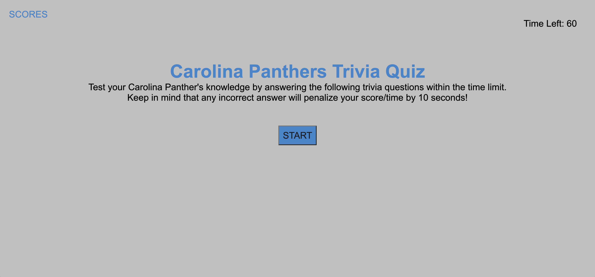
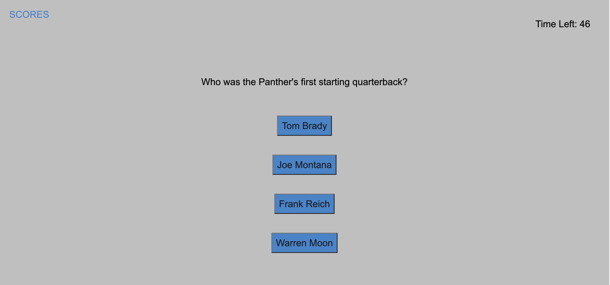
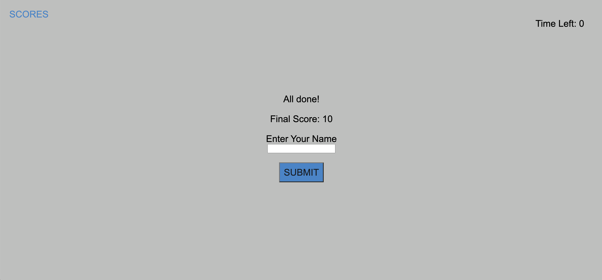
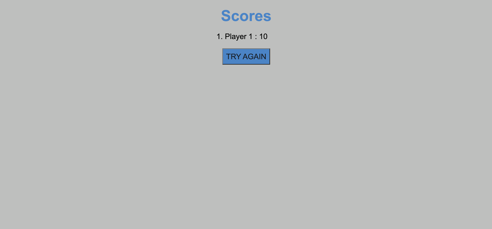

# Carolina Panthers Trivia Quiz ("carolina-panthers-trivia-quiz")

## Table of Contents

* [Description](#description)
* [Requirements](#requirements)
* [Installation](#installation)
* [Contributing](#contributing)
* [Screenshots](#screenshots)

## Description
---
This repository ("carolina-panthers-trivia-quiz") uses HTML, CSS, and JavaScript to create a timed quiz of Carolina Panthers Trivia Questions. 
Users are initially prompted with the instructions for the quiz and a button to start the quiz. Once the user starts, the timer
begins and they are presented with the first question. As they go through the questions and select answers, an indicator flashes
at the bottom to inform them if they are correct or incorrect. If they answer incorrectly, then 10 seconds are subtracted from the 
timer. At the end of the last question, they are presented with their score (the total time remaining on the timer) and an input
field for their name. When they hit 'submit', they are taken to a scores page that pulls all their scores from local storage. They 
are then able to press the try again button to restart the quiz.

Deployed Website: https://smoyamendez.github.io/carolina-panthers-trivia-quiz/

## Requirements 
---
```
GIVEN I am taking a code quiz
WHEN I click the start button
THEN a timer starts and I am presented with a question
WHEN I answer a question
THEN I am presented with another question
WHEN I answer a question incorrectly
THEN time is subtracted from the clock
WHEN all questions are answered or the timer reaches 0
THEN the game is over
WHEN the game is over
THEN I can save my initials and my score

```

## Installation
---
No need for any installation for this project.

See deployed site here: https://smoyamendez.github.io/carolina-panthers-trivia-quiz/

See repository here: https://github.com/smoyamendez/carolina-panthers-trivia-quiz

## Contributing
---

Please review and let me know if you see any ways this code can be improved.

Email: smoyamendez@gmail.com

## Screenshots
---
Home Page



During Quiz



End of Quiz



Scores Page

